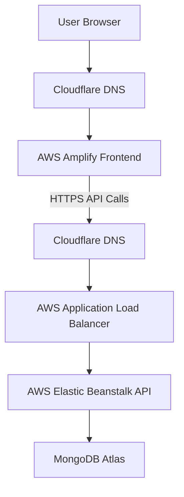
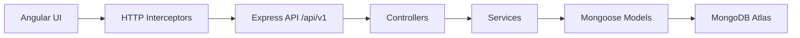
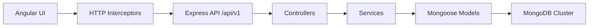

# Access Management Portal


Modern enterprise-grade role-based access management platform built with Angular and Node.js.

Access Management Portal is a premium SaaS-style platform that demonstrates secure authentication, RBAC, dedicated user and records management pages, analytics, responsive layout engineering, and polished async UX. The application is deployed using AWS-managed cloud services, demonstrating full-stack cloud deployment practices and production-style application delivery. It is designed to feel like a production enterprise product while remaining easy to inspect as a portfolio project.

## Live Demo

| Environment | Link |
| --- | --- |
| Frontend deployment | [amp-demo.vedaangsharma.dev](https://amp-demo.vedaangsharma.dev) |
| Backend API | [amp-api.vedaangsharma.dev/api/v1](https://amp-api.vedaangsharma.dev/api/v1) |
| Health check | [amp-api.vedaangsharma.dev/api/v1/health](https://amp-api.vedaangsharma.dev/api/v1/health) |
| Source code | [github.com/gtathelegend/access-management-portal](https://github.com/gtathelegend/access-management-portal) |

## Project Overview

Access Management Portal is a full-stack role-based access and verification system built to simulate a real enterprise operations console. The application was created to showcase how a modern SaaS dashboard can combine authentication, user administration, analytics, async request handling, and design-system consistency in one coherent product.


## Key Features

### Authentication

- JWT authentication
- Secure login flow
- Role-based access control
- Route guards for protected views
- Protected backend endpoints
- Persistent session handling

### Admin Features

- Dedicated user management page at `/users`
- Create, edit, disable, and delete users
- Role assignment and status management
- Dedicated records page at `/records`
- Analytics and operational stats
- Pending verification monitoring
- Overview-only admin dashboard with route shortcuts

### User Features

- Personalized dashboard overview
- Dedicated records page for verification history
- Verification status visibility
- Responsive profile-oriented layout
- Scoped access to user-specific data

### Async Processing Features

- Configurable API delay simulation
- Global loading interceptor
- Route transition loading states
- Skeleton loaders for cards, tables, charts, and sidebars
- Retry handling for transient failures
- Graceful async UX without layout jank

### UI/UX Features

- Apple-inspired visual polish
- Linear-style dashboard composition
- Responsive enterprise layouts
- Dark and light mode support
- Reusable design system primitives
- Smooth transitions and consistent spacing

## Tech Stack

### Frontend

| Technology | Purpose |
|---|---|
| Angular 17+ | Standalone SPA framework |
| TypeScript | Type-safe application code |
| Angular Material | UI primitives and interaction patterns |
| RxJS | Reactive data flow and async orchestration |
| SCSS | Theme tokens, layout, and component styling |

### Backend

| Technology | Purpose |
| --- | --- |
| Node.js | Server runtime |
| Express.js | REST API layer |
| JWT | Authentication and authorization |
| Mongoose | MongoDB data modeling |
| bcrypt | Password hashing |

### Database

| Technology | Purpose |
| --- | --- |
| MongoDB Atlas | Managed production database |

### Deployment

| Platform | Purpose |
| --- | --- |
| AWS Amplify | Angular application hosting and frontend build orchestration |
| AWS Elastic Beanstalk | Node.js API hosting and managed runtime lifecycle |
| AWS Application Load Balancer | HTTPS traffic routing to the backend service |
| AWS Certificate Manager | TLS certificate provisioning and renewal |
| Cloudflare | DNS, subdomain routing, and edge-controlled domain management |
| MongoDB Atlas | Managed cloud database for application state |

This production stack mirrors a real SaaS delivery model: the frontend is independently deployed on Amplify, the backend is isolated on Elastic Beanstalk, TLS is terminated and renewed through ACM, the ALB fronts the API layer, Cloudflare owns public DNS, and MongoDB Atlas provides managed data persistence.

## Production Cloud Deployment

The application is deployed using a cloud-native architecture that separates presentation, application, and data concerns the same way a production SaaS platform would.



### Custom Domain & SSL Setup

The public frontend is served from [https://amp-demo.vedaangsharma.dev](https://amp-demo.vedaangsharma.dev), while the backend API is exposed through the custom API domain [https://amp-api.vedaangsharma.dev/api/v1](https://amp-api.vedaangsharma.dev/api/v1).

This was implemented to give the project a realistic production footprint: a branded frontend domain, a separate API domain, and a clean `/api/v1` boundary that is easy to document, monitor, and scale.

- Cloudflare manages the DNS zone and routes the custom subdomains.
- AWS Amplify serves the Angular frontend over HTTPS.
- AWS Certificate Manager issues and renews the backend SSL certificate.
- The Application Load Balancer terminates HTTPS traffic and forwards requests to Elastic Beanstalk.
- HTTP requests are redirected to HTTPS so the application is always accessed securely.
- The frontend talks to the backend using the production API base URL from the environment configuration.

### HTTPS & Security Hardening

The deployment is hardened so the app behaves like a real secure SaaS platform rather than a demo site.

- TLS encryption protects traffic in transit between users, the frontend, and the API.
- ACM-managed certificates remove manual certificate rotation and reduce operational risk.
- HTTPS-only communication prevents credentials and tokens from traveling over plain HTTP.
- Secure API access keeps the backend behind a load balancer instead of exposing the service directly.
- CORS configuration restricts browser access to the approved frontend origin.
- Environment variables keep secrets and deployment-specific values out of the source tree.
- JWT authentication secures user sessions and protects privileged API routes.
- Rate limiting reduces abuse risk and helps protect authentication endpoints.
- Secure headers add baseline browser hardening for common web attacks.

### AWS Infrastructure Components

| Component | Service | Purpose |
|------------|------------|------------|
| Frontend Hosting | AWS Amplify | Angular application hosting |
| Backend Hosting | AWS Elastic Beanstalk | Node.js API hosting |
| Load Balancer | AWS ALB | HTTPS traffic routing |
| SSL Certificates | AWS ACM | TLS certificate management |
| DNS Management | Cloudflare | Domain routing |
| Database | MongoDB Atlas | Managed NoSQL database |

These services work together as a layered production platform: Cloudflare handles the public domain entry points, Amplify delivers the frontend, ALB and ACM secure and route the API traffic, Elastic Beanstalk runs the application process, and MongoDB Atlas persists the operational data.

## Cloud Engineering Highlights

This project demonstrates production cloud engineering in a way recruiters can map directly to real-world platform work.

- AWS cloud deployment across managed frontend, backend, routing, and database services.
- Custom domain management with separate branded frontend and API subdomains.
- SSL certificate provisioning and renewal through ACM.
- HTTPS enforcement across the full request path.
- Cloud networking concepts including DNS routing, load balancing, and origin separation.
- Managed infrastructure services that reduce operational overhead while staying production-ready.
- End-to-end deployment workflows from source control to live cloud environments.
- Frontend/backend integration through explicit environment-based API configuration.
- Cloud database connectivity using MongoDB Atlas rather than a local or self-hosted database.

## Real-World Engineering Decisions

The deployment choices were made for scalability, maintainability, security, and developer experience.

- AWS Amplify was chosen for the frontend because it provides simple CI/CD, atomic deployments, HTTPS, and fast static delivery for Angular builds.
- AWS Elastic Beanstalk was chosen for the backend because it handles Node.js runtime management, deployment orchestration, and environment lifecycle without forcing the team to manage servers directly.
- MongoDB Atlas was used because it offers a managed cloud database with scaling, backups, and connection-string-based integration.
- AWS Application Load Balancer was added so the backend sits behind a production-grade HTTPS entry point instead of being exposed directly.
- AWS Certificate Manager was used so SSL certificates are provisioned and renewed automatically.
- Cloudflare was integrated to manage DNS records and custom domain routing while keeping the public subdomains clean and predictable.

## Cloud & Infrastructure Skills Demonstrated

This project shows practical experience with cloud delivery patterns that are expected in production engineering teams.

- AWS Amplify for frontend delivery and build automation.
- AWS Elastic Beanstalk for managed backend hosting.
- AWS Application Load Balancer for secure request routing.
- AWS Certificate Manager for automated TLS certificate management.
- Cloudflare DNS for custom domain control.
- MongoDB Atlas for managed cloud persistence.
- Environment management for production configuration.
- HTTPS security for safe browser-to-backend communication.
- Custom domains for professional SaaS-style branding.
- Production deployments that separate build, routing, and runtime concerns.

## Health Check

The backend exposes a health endpoint that is used by the load balancer and by deployment verification checks.

```http
GET /health
```

Purpose:

- Load balancer health checks
- Deployment verification
- Monitoring endpoint

Example response:

```json
{
  "status": "ok",
  "message": "Access Management Portal API running"
}
```

## Production Cloud Deployment

```text
Client Browser
  ↓
AWS Amplify
(Angular Frontend)
  ↓
AWS Elastic Beanstalk
(Node.js API)
  ↓
MongoDB Atlas
```

The frontend is served by AWS Amplify and calls the backend through environment-configured API URLs. Elastic Beanstalk runs the Express API, applies production environment variables, and forwards database operations to MongoDB Atlas. Cloudflare keeps the custom subdomains stable while ACM and the ALB enforce end-to-end HTTPS. This keeps the presentation, application, and data tiers clearly separated while remaining easy to operate in AWS.

## Architecture

### Frontend Architecture

The frontend uses Angular 17 standalone architecture with a modular feature layout. Shared UI behavior is centralized through reusable components, while route-specific behavior remains isolated in feature modules.

```txt
src/app
├── core
├── shared
├── features
└── layouts
```

#### Folder Responsibilities

| Folder | Responsibility |
|---|---|
| `core` | Authentication, API services, guards, interceptors, models, and global application logic |
| `shared` | Reusable UI primitives, skeletons, modal shells, tables, buttons, and cross-feature components |
| `features` | Business pages such as auth, dashboard, analytics, users, records, and settings |
| `layouts` | App shell, top navigation, sidebar, and structural layout composition |

### Backend Architecture

The backend uses an enterprise-style layered structure that keeps routing, business rules, and data access separate.

```txt
src
├── controllers
├── services
├── middleware
├── routes
├── models
└── config
```

#### Folder Responsibilities

| Folder | Responsibility |
|---|---|
| `controllers` | HTTP request/response handling |
| `services` | Business logic and database aggregation |
| `middleware` | Authentication, authorization, rate limiting, logging, delays, and error handling |
| `routes` | Versioned REST route registration |
| `models` | Mongoose schemas and data validation |
| `config` | Environment, database, and app configuration |

### System Design



## System Design

### Authentication Flow

1. The user submits credentials through the login form.
2. The backend validates the request and compares the password with bcrypt.
3. On success, a JWT is issued and stored client-side for session persistence.
4. Angular guards block unauthorized routes on the frontend.
5. The auth interceptor attaches the bearer token to protected requests.

### API Flow

1. The frontend calls the appropriate `/api/v1/*` endpoint through typed services.
2. The loading interceptor tracks request counts and route transitions.
3. The Express router forwards the request to a controller.
4. The controller delegates to a service for business logic.
5. The service queries MongoDB through Mongoose models and returns a normalized payload.

### RBAC Flow

- Users authenticate through JWT.
- Route guards and middleware verify role claims.
- Admin endpoints are blocked for non-admin users.
- User-specific pages only expose the current user’s scoped data.

### Async Handling Architecture

- The loading interceptor drives the global loading bar and spinner.
- Skeleton loaders preserve layout stability while requests are pending.
- Retry handling gives users a clear recovery path when requests fail.
- Artificial delay support makes loading states visible for demos and QA.

## UI/UX Design Philosophy

This project intentionally follows an Apple-inspired enterprise aesthetic with a Linear-style dashboard structure.

### Design Principles

- Semantic CSS variables are used for all themes, surfaces, borders, and accent colors.
- Layout spacing is token-driven to preserve rhythm across screens.
- Typography hierarchy emphasizes clarity, hierarchy, and quiet confidence.
- Dark mode uses the same layout and spacing system as light mode to avoid shifts.
- Components are designed to be reusable, consistent, and accessible.

### UI Goals

- Premium enterprise feel
- High information density without visual clutter
- Strong visual hierarchy
- Responsive behavior without layout jumps
- Accessible contrast in both themes

## Security

Security is handled with production-oriented controls across the stack.

- JWT protects authenticated routes and API access.
- Passwords are hashed with `bcrypt` before storage.
- Protected routes require valid bearer tokens.
- `helmet` hardens HTTP headers.
- `express-rate-limit` reduces brute-force login abuse.
- Environment variables keep secrets out of source control.

## Performance Optimizations

- Standalone Angular components reduce module overhead.
- Lazy-loaded feature routes improve initial page load behavior.
- Reusable shared components prevent duplication.
- Pagination keeps large datasets manageable.
- RxJS operators are used to debounce, compose, and stabilize async interactions.
- API delay simulation is isolated so UX testing does not pollute business logic.

## Responsiveness

The application is engineered for desktop, tablet, and mobile use.

- Desktop layouts use balanced dashboard grids and roomy content widths.
- Tablet layouts collapse the sidebar and stack dashboard content appropriately.
- Mobile layouts use a drawer sidebar, compact navbar, and full-width dialogs.
- Tables use horizontal scrolling and sticky headers instead of clipping content.
- Dialogs adapt to viewport size and become fullscreen on small screens.

## Dark Mode

Dark mode is built on a centralized CSS variable system rather than duplicated style branches.

- Semantic tokens define surface, border, text, and accent colors.
- Theme switching updates the root class without disturbing layout geometry.
- The dark palette is tuned for contrast, legibility, and a macOS-like visual tone.
- Component shadows and borders are adjusted so elevation feels natural in both modes.

## API Documentation

All endpoints are served under `/api/v1`.

### Common Response Shape

```json
{
  "success": true,
  "statusCode": 200,
  "data": {}
}
```

### Auth Headers

Authorization: Bearer <JWT>


{
  "password": "admin123"
```
Response:
```json
{
  "success": true,
  "statusCode": 200,
  "data": {
    "token": "<jwt>",
    "user": {
      "id": "<user-id>",
      "name": "Admin User",
      "email": "admin@portal.com",
      "role": "admin"
    }
  }
}
```

### User APIs

#### GET `/api/v1/users`

Returns a paginated user list with search and filtering.

Request query:

```txt
page=1&limit=10&q=admin&role=admin&status=active
```

Response:

```json
{
  "success": true,
  "statusCode": 200,
  "data": {
    "items": [],
    "page": 1,
    "limit": 10,
    "total": 0,
    "totalPages": 0
  }
}
```

#### POST `/api/v1/users`

Creates a new user.

Request:

```json
{
  "name": "New User",
  "email": "new@portal.com",
  "password": "SecurePass123",
  "role": "user",
  "status": "active"
}
```

Response:

```json
{
  "success": true,
  "statusCode": 201,
  "data": {
    "id": "<id>",
    "name": "New User",
    "email": "new@portal.com",
    "role": "user",
    "status": "active"
  }
}
```

#### PUT `/api/v1/users/:id`

Updates an existing user.

Request:

```json
{
  "name": "Updated User",
  "role": "admin",
  "status": "active"
}
```

Response:

```json
{
  "success": true,
  "statusCode": 200,
  "data": {
    "id": "<id>",
    "name": "Updated User"
  }
}
```

#### DELETE `/api/v1/users/:id`

Deletes a user.

Response:

```json
{
  "success": true,
  "statusCode": 204,
  "data": null
}
```

### Record APIs

#### GET `/api/v1/records`

Returns paginated verification records.

Request query:

```txt
page=1&limit=10&status=pending&sortBy=createdAt&sortOrder=desc
```

Response:

```json
{
  "success": true,
  "statusCode": 200,
  "data": {
    "items": [],
    "page": 1,
    "limit": 10,
    "total": 0,
    "totalPages": 0
  }
}
```

### Stats APIs

#### GET `/api/v1/stats`

Returns a consolidated dashboard stats payload for the admin analytics surface.

Response:

```json
{
  "success": true,
  "statusCode": 200,
  "data": {
    "totalUsers": 120,
    "activeUsers": 108,
    "adminCount": 8,
    "pendingVerifications": 14,
    "disabledUsers": 12,
    "recentActivityCount": 31,
    "verificationStats": {
      "roleDistribution": [
        { "name": "admin", "value": 8 },
        { "name": "user", "value": 112 }
      ],
      "statusBreakdown": [
        { "name": "approved", "value": 92 },
        { "name": "pending", "value": 14 },
        { "name": "rejected", "value": 14 }
      ],
      "verificationTrends": [
        { "name": "2026-05-24", "value": 6 }
      ]
    }
  }
}
```

> Note: the backend also keeps `/api/v1/analytics/dashboard-stats` as a compatibility alias that returns the same payload.

## Database Schema

### User Schema

The `User` collection stores authentication and lifecycle state.

Key fields:

- `name`
- `email`
- `password`
- `role` (`admin` or `user`)
- `status` (`active` or `disabled`)
- timestamps

Example:

```json
{
  "name": "Admin User",
  "email": "admin@portal.com",
  "password": "<hashed-password>",
  "role": "admin",
  "status": "active",
  "createdAt": "2026-05-24T10:00:00.000Z",
  "updatedAt": "2026-05-24T10:00:00.000Z"
}
```

### Record Schema

The `Record` collection stores verification and access records.

Key fields:

- `userId`
- `verificationType`
- `status` (`pending`, `approved`, `rejected`)
- `approvedBy`
- `accessLevel`
- timestamps

Example:

```json
{
  "userId": "6650f2a8d8d5e4b9c1b9a123",
  "verificationType": "Identity Verification",
  "status": "pending",
  "approvedBy": null,
  "accessLevel": "standard",
  "createdAt": "2026-05-24T10:00:00.000Z",
  "updatedAt": "2026-05-24T10:00:00.000Z"
}
```

### Role System

- `admin` users manage the portal, users, and analytics.
- `user` accounts are limited to their own profile and record views.

## Installation

### Prerequisites

- Node.js 18+
- npm 9+
- MongoDB Atlas cluster

### Frontend Setup

```bash
cd frontend
npm install
npm start
```


cd backend


## Environment Variables
### Backend `.env.example`
NODE_ENV=development
MONGODB_URI=mongodb+srv://<user>:<password>@<cluster>/<db>
JWT_SECRET=replace-with-a-strong-secret
JWT_EXPIRES_IN=7d
CLIENT_URL=http://localhost:4200
BCRYPT_SALT_ROUNDS=12
```

### Frontend `.env.example`

```env
API_BASE_URL=http://localhost:3000/api/v1
```

## Deployment

### Frontend on AWS Amplify

1. Connect the repository to AWS Amplify.
2. Set `API_BASE_URL` to `https://amp-api.vedaangsharma.dev/api/v1`.
3. Deploy the Angular frontend.

### Backend on AWS Elastic Beanstalk

1. Create an Elastic Beanstalk Node.js environment for the `backend` folder.
2. Set the backend environment variables listed above.
3. Use the production start command from the backend package.

### MongoDB Atlas

1. Create an Atlas cluster.
2. Add a database user and whitelist your IP or use 0.0.0.0/0 for controlled demos.
3. Copy the connection string into `MONGODB_URI`.

## Dummy Credentials

| Role | Email | Password |
|---|---|---|
| Admin | `admin@portal.com` | `admin123` |
| User | `user@portal.com` | `user123` |


## Future Enhancements

- Audit log history
- WebSocket live updates
- In-app notifications
- Docker containerization
- ECS migration
- CloudWatch monitoring
- CI/CD enhancements
- Infrastructure as Code
- Auto-scaling policies
- Expanded analytics and forecasting

## Engineering Highlights

This project was designed to demonstrate real engineering decisions rather than a superficial CRUD demo.

### Why Standalone Angular Architecture

- Reduces framework overhead and keeps the application composition explicit.
- Encourages highly reusable feature and UI components.
- Makes lazy loading and route-level organization more straightforward.
- Fits well with a modern enterprise dashboard where independent feature composition matters.

### Why a Modular Backend Architecture

- Separates routing, business logic, and persistence concerns.
- Makes the API easier to scale, test, and extend.
- Keeps controller logic thin and service logic reusable.
- Supports clear ownership of auth, user, record, and analytics domains.

### Why Async Simulation Matters

- Demonstrates that the frontend can handle real-world latency gracefully.
- Makes loading states, retry states, and skeleton states visible during review.
- Proves that the UI remains stable while requests are pending.
- Shows production-minded UX thinking rather than optimistic mock-data rendering.

## License

This project is licensed under the MIT License.


## Overview

The application is split into two parts:

- `frontend/`: Angular 17 standalone SPA with Angular Material, SSR/prerender support, responsive dashboards, and global HTTP interceptors.
- `backend/`: Express + TypeScript API with JWT authentication, role authorization, MongoDB/Mongoose models, and modular service/controller architecture.

The backend exposes versioned REST endpoints under `/api/v1`, while the frontend consumes those APIs through environment-configured service clients.

## Deployed Links

- Frontend (AWS Amplify): [https://amp-demo.vedaangsharma.dev](https://amp-demo.vedaangsharma.dev)
- Backend API (AWS Elastic Beanstalk): [https://amp-api.vedaangsharma.dev/api/v1](https://amp-api.vedaangsharma.dev/api/v1)
  - Base path: `/api/v1` (example health check: [https://amp-api.vedaangsharma.dev/api/v1/health](https://amp-api.vedaangsharma.dev/api/v1/health))

## Features

### Authentication and Authorization

- JWT-based sign-in
- Persistent session handling
- Route protection for authenticated users
- Admin-only authorization for management pages and APIs

### User Dashboard (Role: `user`)

- Personal profile summary
- Verification records table (scoped to the logged-in user)
- Sorting + pagination, plus client-side quick filtering
- Loading skeletons, empty states, and retry UI

### Admin Dashboard (Role: `admin`)

- Summary stats (total users, active users, admin count, pending verifications)
- User directory with:
  - Server-side pagination
  - Search by name/email (`q`)
  - Role/status filters
  - Create/edit/delete flows (dialogs + confirmation)

### Async UX

- Global loading spinner
- Progress bar feedback
- Request retry handling
- Error retry UI
- Artificial API delay simulation for testing loading states

### Analytics

- Requests by status (pie chart)
- Verification trends (bar chart, last 30 points)
- Role distribution (horizontal bar chart)

### Deployment Ready

- AWS Amplify frontend hosting at [https://amp-demo.vedaangsharma.dev](https://amp-demo.vedaangsharma.dev)
- Elastic Beanstalk backend deployment behind an ALB at [https://amp-api.vedaangsharma.dev/api/v1](https://amp-api.vedaangsharma.dev/api/v1)
- ACM-managed SSL certificates and HTTPS enforcement
- Cloudflare DNS management for custom subdomains
- Environment-based API base URL handling through `API_BASE_URL`

## Dashboards and Behaviors

### Navigation / Routing

- Unauthenticated users are redirected to `/auth/login` (with a `returnUrl` query param).
- After login, `/dashboard` redirects based on role:
  - `admin` → `/dashboard/admin`
  - `user` → `/dashboard/user`
- Admin-only routes are protected via a role guard (non-admins are redirected back to `/dashboard`).
- `/users` is admin-only and `/records` is available to both `admin` and `user` roles.

### Admin Dashboard (`/dashboard/admin`)

- “Operations console” overview cards are calculated from API totals (users + pending verifications).
- The dashboard now shows overview snapshots rather than the full CRUD directory.
- Quick actions route to `/users` and `/records` for full management.
- Empty states and retry UI are shown when the API is unreachable.

### User Dashboard (`/dashboard/user`)

- Shows a compact snapshot of the logged-in user’s verification records.
- Supports quick filtering on the loaded subset and includes a shortcut to `/records`.
- Includes loading states, empty states, and a retry action.

### Analytics (`/analytics`)

- Charts are driven by `/api/v1/analytics/dashboard-stats`:
  - Requests by status
  - Verification trends
  - Role distribution

### Notes

- `/users` and `/records` are now dedicated management pages, while the dashboards are overview-only.
- SSR/prerender paths avoid making API calls while rendering on the server (browser-only fetch).

## Tech Stack

| Layer | Technologies |
|---|---|
| Frontend | Angular 17, TypeScript, RxJS, Angular Material, SCSS, NGX Charts |
| Backend | Node.js, Express, TypeScript, Mongoose, JWT, bcryptjs |
| Database | MongoDB Atlas / MongoDB Cluster |
| Tooling | ESLint, Prettier, tsx, Angular CLI |

## Architecture

### Frontend Architecture

```txt
src/app
├── core
│   ├── services
│   ├── guards
│   ├── interceptors
│   └── models
├── features
│   ├── auth
│   ├── dashboard
│   ├── users
│   ├── records
│   └── analytics
├── layouts
└── shared
```

### Backend Architecture

```txt
backend/src
├── config
├── controllers
├── middleware
├── models
├── routes
├── services
├── scripts
└── utils
```

### Request Flow



## Folder Structure

```txt
access-management-portal
├── backend
│   ├── src
│   └── package.json
├── frontend
│   ├── src
│   ├── angular.json
│   └── package.json
├── amplify.yml
└── README.md
```

## API Documentation

All API routes are served under `/api/v1`.

### Response Conventions

- Success responses return normal JSON payloads (varies by endpoint).
- Error responses use:

```json
{ "success": false, "message": "..." }
```

### Pagination

List endpoints return a standard pagination shape:

```json
{
  "items": [],
  "page": 1,
  "limit": 20,
  "total": 0,
  "totalPages": 1
}
```

### Auth Headers

Authenticated routes require a bearer token:

```txt
Authorization: Bearer <JWT>
```

### Authentication

| Method | Endpoint | Description |
|---|---|---|
| POST | `/api/v1/auth/login` | Sign in with email and password |

Request body:

```json
{
  "email": "admin@amp.local",
  "password": "Admin@1234"
}
```

Response body:

```json
{
  "token": "<jwt>",
  "user": {
    "id": "<id>",
    "name": "System Admin",
    "email": "admin@amp.local",
    "role": "admin"
  }
}
```

### Users

Admin-only endpoints.

| Method | Endpoint | Description |
|---|---|---|
| GET | `/api/v1/users` | List users with pagination, filtering, and search |
| POST | `/api/v1/users` | Create a new user |
| PUT | `/api/v1/users/:id` | Update a user |
| DELETE | `/api/v1/users/:id` | Delete a user |

Query parameters supported by `GET /users`:

- `page`
- `limit`
- `role`
- `status`
- `q`

Notes / behaviors:

- `limit` is clamped to `1..100`.
- Search (`q`) matches user `name` and `email` (case-insensitive).
- Creating a user with an existing email returns `409`.

### Records

| Method | Endpoint | Description |
|---|---|---|
| GET | `/api/v1/records` | List access records with pagination and filtering |
| GET | `/api/v1/records/:id` | Get a specific record |

Supported filters include:

- `page`
- `limit`
- `sortBy`
- `sortOrder`
- `status`
- `verificationType`
- `accessLevel`
- `userId`
- `approvedBy`
- `createdFrom`
- `createdTo`

Notes / behaviors:

- Non-admin users are automatically scoped to their own records (even if `userId` is provided).
- Admin users can use `userId` to scope records; invalid `userId` returns `400`.
- If a non-admin requests someone else’s record by id, the API returns `404` (to avoid leaking existence).
- `createdFrom` / `createdTo` must be valid dates or the API returns `400`.

### Analytics

| Method | Endpoint | Description |
|---|---|---|
| GET | `/api/v1/analytics/dashboard-stats` | Dashboard statistics for the analytics page |

### Health

| Method | Endpoint | Description |
|---|---|---|
| GET | `/api/v1/health` | Health and readiness check |

### Common Error Cases

- `401 Unauthorized`: missing/invalid/expired JWT (protected routes).
- `403 Forbidden`: authenticated but not allowed (admin-only routes).
- `404 Not Found`: resource not found (also used for record access control to avoid leaks).
- `409 Conflict`: email already in use (create/update user).
- `400 Bad Request`: invalid IDs, invalid dates, or invalid request payloads.

## Setup Instructions

### 1. Clone and install dependencies

```bash
git clone https://github.com/gtathelegend/access-management-portal
cd access-management-portal
cd backend && npm install
cd ../frontend && npm install
```

### 2. Configure backend environment

Create a `backend/.env` file with the variables listed below.

### 3. Seed the database

```bash
cd backend
npm run seed
```

After seeding, you can sign in with these demo accounts:

See: [Test Credentials](#test-credentials)

### 4. Run locally

Backend:

```bash
cd backend
npm run dev
```

Frontend:

```bash
cd frontend
npm start
```

## Deployment Instructions

### Frontend on AWS Amplify

- Production builds use `frontend/src/environments/environment.production.ts`.
- The frontend reads its API base URL from `environment.apiUrl`.
- On AWS Amplify, the API base URL is injected at build time via `API_BASE_URL`.

Steps:

1. Connect the GitHub repository to AWS Amplify.
2. Set `API_BASE_URL` to `https://amp-api.vedaangsharma.dev/api/v1`.
3. Redeploy the frontend so Amplify rebuilds with the production API base URL.
4. Verify the app loads from [https://amp-demo.vedaangsharma.dev](https://amp-demo.vedaangsharma.dev).

Production build:

```bash
cd frontend
npm run build
```

### Backend on AWS Elastic Beanstalk

Deploy the Express API to AWS Elastic Beanstalk behind the Application Load Balancer and set the required environment variables.

Recommended runtime settings:

- `NODE_ENV=production`
- `PORT=<your-host-provided-port>`
- `MONGODB_URI=<your MongoDB Atlas connection string>`
- `JWT_SECRET=<a strong random secret>`
- `JWT_EXPIRES_IN=<token lifetime, for example 7d>`
- `CLIENT_URL=https://amp-demo.vedaangsharma.dev`

Production deployment notes:

- Build the backend first with `npm run build` so `dist/server.js` is present in the bundle.
- Attach the ACM certificate to the ALB listener and redirect HTTP to HTTPS.
- Route the custom domain through Cloudflare so the API resolves to [https://amp-api.vedaangsharma.dev/api/v1](https://amp-api.vedaangsharma.dev/api/v1).
- Confirm the health endpoint responds with the expected payload before publishing the frontend.

Elastic Beanstalk manages the Node.js runtime, deployment automation, and environment provisioning for the API.

## Environment Variables

### Backend

| Variable | Required | Description |
| --- | --- | --- |
| `PORT` | Yes | Server port exposed by Elastic Beanstalk |
| `NODE_ENV` | Yes | Must be `development`, `test`, or `production` |
| `MONGODB_URI` | Yes | MongoDB Atlas connection string |
| `JWT_SECRET` | Yes | Secret used to sign and verify JWTs |
| `JWT_EXPIRES_IN` | Yes | JWT expiration, for example `7d` |
| `CLIENT_URL` | Yes | Allowed frontend origin for CORS and redirects |
| `BCRYPT_SALT_ROUNDS` | No | Password hashing cost, defaults to `12` |

### Frontend

| Variable/File | Required | Description |
| --- | --- | --- |
| `frontend/src/environments/environment.ts` | Yes | Development API base URL |
| `frontend/src/environments/environment.production.ts` | Yes | Production API base URL template used during the Amplify build |
| `API_BASE_URL` (Amplify env var) | Yes | Backend API base URL injected during the Amplify build, for example `https://amp-api.vedaangsharma.dev/api/v1` |

## Test Credentials

Run the seed script first to populate the database, then use these demo accounts for testing:

| Role | Email | Password |
|---|---|---|
| Admin | `admin@amp.local` | `Admin@1234` |
| Admin | `security@amp.local` | `Security@1234` |
| User | `ava.carter@amp.local` | `User@1234` |
| User | `noah.patel@amp.local` | `User@1234` |
| User | `sophia.chen@amp.local` | `User@1234` |
| User | `lucas.miller@amp.local` | `User@1234` |
| User | `emma.wilson@amp.local` | `User@1234` |
| User | `james.taylor@amp.local` | `User@1234` |
| Disabled user | `mia.gomez@amp.local` | `User@1234` |
| Disabled user | `oliver.brown@amp.local` | `User@1234` |

Disabled users cannot sign in (login returns `401 Invalid email or password` to avoid leaking account status).

## MongoDB Collections

The seed script populates these collections:

- `users`
- `records`

## Scripts

### Backend

- `npm run dev`: Start the backend in development mode
- `npm run build`: Compile TypeScript
- `npm run start`: Run the compiled backend
- `npm run seed`: Seed MongoDB with demo users and records
- `npm run lint`: Run ESLint
- `npm run format`: Format backend source files

### Frontend

- `npm start`: Start Angular development server
- `npm run build`: Build the frontend for production
- `npm run test`: Run unit tests
- `npm run lint`: Run Angular linting


