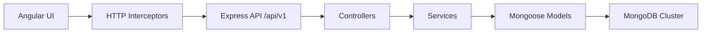

# Access Management Portal

Access Management Portal is an enterprise-style role-based access control and verification management system built with Angular, Node.js, TypeScript, Express, and MongoDB.

It includes secure login, role-based dashboards, user administration, verification record browsing, analytics, async loading states, and a polished SaaS-style UI inspired by products like Linear, Vercel, Clerk, and Notion.

## Overview

The application is split into two parts:

- `frontend/`: Angular 17 standalone SPA with Angular Material, SSR/prerender support, responsive dashboards, and global HTTP interceptors.
- `backend/`: Express + TypeScript API with JWT authentication, role authorization, MongoDB/Mongoose models, and modular service/controller architecture.

The backend exposes versioned REST endpoints under `/api/v1`, while the frontend consumes those APIs through environment-configured service clients.

## Deployed Links

- Frontend (Vercel): `https://amp.vedaangsharma.dev/`
- Backend API (Render): `https://access-management-portal.onrender.com`
  - Base path: `/api/v1` (example health check: `https://access-management-portal.onrender.com/api/v1/health`)

## Features

### Authentication and Authorization

- JWT-based sign-in
- Persistent session handling
- Route protection for authenticated users
- Admin-only authorization for management pages and APIs

### User Dashboard (Role: `user`)

- Personal profile summary
- Verification records table (scoped to the logged-in user)
- Sorting + pagination, plus client-side quick filtering
- Loading skeletons, empty states, and retry UI

### Admin Dashboard (Role: `admin`)

- Summary stats (total users, active users, admin count, pending verifications)
- User directory with:
  - Server-side pagination
  - Search by name/email (`q`)
  - Role/status filters
  - Create/edit/delete flows (dialogs + confirmation)

### Async UX

- Global loading spinner
- Progress bar feedback
- Request retry handling
- Error retry UI
- Artificial API delay simulation for testing loading states

### Analytics

- Requests by status (pie chart)
- Verification trends (bar chart, last 30 points)
- Role distribution (horizontal bar chart)

### Deployment Ready

- Vercel-friendly frontend configuration
- Production environment file replacement
- SPA route rewrites
- Environment-based API base URL handling

## Dashboards and Behaviors

### Navigation / Routing

- Unauthenticated users are redirected to `/auth/login` (with a `returnUrl` query param).
- After login, `/dashboard` redirects based on role:
  - `admin` → `/dashboard/admin`
  - `user` → `/dashboard/user`
- Admin-only routes are protected via a role guard (non-admins are redirected back to `/dashboard`).

### Admin Dashboard (`/dashboard/admin`)

- “Operations console” overview cards are calculated from API totals (users + pending verifications).
- User directory supports:
  - Search by name/email (debounced)
  - Role/status filters
  - Server-side pagination
  - CRUD flows with dialogs + confirm delete
- Empty states and retry UI are shown when there are no results or when the API is unreachable.

### User Dashboard (`/dashboard/user`)

- Shows the logged-in user’s verification records (API enforces scoping).
- Supports sort + pagination, and a quick filter box for client-side searching.
- Includes loading states, empty states, and a retry action.

### Analytics (`/analytics`)

- Charts are driven by `/api/v1/analytics/dashboard-stats`:
  - Requests by status
  - Verification trends
  - Role distribution

### Notes

- `/users` and `/records` pages exist but currently contain placeholder UI; the “live” functionality is in the dashboards above.
- SSR/prerender paths avoid making API calls while rendering on the server (browser-only fetch).

## Tech Stack

| Layer | Technologies |
|---|---|
| Frontend | Angular 17, TypeScript, RxJS, Angular Material, SCSS, NGX Charts |
| Backend | Node.js, Express, TypeScript, Mongoose, JWT, bcryptjs |
| Database | MongoDB Atlas / MongoDB Cluster |
| Tooling | ESLint, Prettier, tsx, Angular CLI |

## Architecture

### Frontend Architecture

```txt
src/app
├── core
│   ├── services
│   ├── guards
│   ├── interceptors
│   └── models
├── features
│   ├── auth
│   ├── dashboard
│   ├── users
│   ├── records
│   └── analytics
├── layouts
└── shared
```

### Backend Architecture

```txt
backend/src
├── config
├── controllers
├── middleware
├── models
├── routes
├── services
├── scripts
└── utils
```

### Request Flow



## Folder Structure

```txt
access-management-portal
├── backend
│   ├── src
│   └── package.json
├── frontend
│   ├── src
│   ├── angular.json
│   ├── vercel.json
│   └── package.json
└── README.md
```

## API Documentation

All API routes are served under `/api/v1`.

### Response Conventions

- Success responses return normal JSON payloads (varies by endpoint).
- Error responses use:

```json
{ "success": false, "message": "..." }
```

### Pagination

List endpoints return a standard pagination shape:

```json
{
  "items": [],
  "page": 1,
  "limit": 20,
  "total": 0,
  "totalPages": 1
}
```

### Auth Headers

Authenticated routes require a bearer token:

```txt
Authorization: Bearer <JWT>
```

### Authentication

| Method | Endpoint | Description |
|---|---|---|
| POST | `/api/v1/auth/login` | Sign in with email and password |

Request body:

```json
{
  "email": "admin@amp.local",
  "password": "Admin@1234"
}
```

Response body:

```json
{
  "token": "<jwt>",
  "user": {
    "id": "<id>",
    "name": "System Admin",
    "email": "admin@amp.local",
    "role": "admin"
  }
}
```

### Users

Admin-only endpoints.

| Method | Endpoint | Description |
|---|---|---|
| GET | `/api/v1/users` | List users with pagination, filtering, and search |
| POST | `/api/v1/users` | Create a new user |
| PUT | `/api/v1/users/:id` | Update a user |
| DELETE | `/api/v1/users/:id` | Delete a user |

Query parameters supported by `GET /users`:

- `page`
- `limit`
- `role`
- `status`
- `q`

Notes / behaviors:

- `limit` is clamped to `1..100`.
- Search (`q`) matches user `name` and `email` (case-insensitive).
- Creating a user with an existing email returns `409`.

### Records

| Method | Endpoint | Description |
|---|---|---|
| GET | `/api/v1/records` | List access records with pagination and filtering |
| GET | `/api/v1/records/:id` | Get a specific record |

Supported filters include:

- `page`
- `limit`
- `sortBy`
- `sortOrder`
- `status`
- `verificationType`
- `accessLevel`
- `userId`
- `approvedBy`
- `createdFrom`
- `createdTo`

Notes / behaviors:

- Non-admin users are automatically scoped to their own records (even if `userId` is provided).
- Admin users can use `userId` to scope records; invalid `userId` returns `400`.
- If a non-admin requests someone else’s record by id, the API returns `404` (to avoid leaking existence).
- `createdFrom` / `createdTo` must be valid dates or the API returns `400`.

### Analytics

| Method | Endpoint | Description |
|---|---|---|
| GET | `/api/v1/analytics/dashboard-stats` | Dashboard statistics for the analytics page |

### Health

| Method | Endpoint | Description |
|---|---|---|
| GET | `/api/v1/health` | Health and readiness check |

### Common Error Cases

- `401 Unauthorized`: missing/invalid/expired JWT (protected routes).
- `403 Forbidden`: authenticated but not allowed (admin-only routes).
- `404 Not Found`: resource not found (also used for record access control to avoid leaks).
- `409 Conflict`: email already in use (create/update user).
- `400 Bad Request`: invalid IDs, invalid dates, or invalid request payloads.

## Setup Instructions

### 1. Clone and install dependencies

```bash
git clone <your-repo-url>
cd access-management-portal
cd backend && npm install
cd ../frontend && npm install
```

### 2. Configure backend environment

Create a `backend/.env` file with the variables listed below.

### 3. Seed the database

```bash
cd backend
npm run seed
```

After seeding, you can sign in with these demo accounts:

See: [Test Credentials](#test-credentials)

### 4. Run locally

Backend:

```bash
cd backend
npm run dev
```

Frontend:

```bash
cd frontend
npm start
```

## Deployment Instructions

### Frontend on Vercel

- Production builds use `frontend/src/environments/environment.production.ts`
- The frontend reads its API base URL from `environment.apiUrl`
- On Vercel, the API base URL is injected at build time via the `BACKEND_API_URL` environment variable

Steps:

1. Deploy the backend API (any host is fine).
2. In your Vercel project (Frontend), set `BACKEND_API_URL` to your backend API base URL, including `/api/v1`.
   - Example (this repo’s deployed backend): `https://access-management-portal.onrender.com/api/v1`
3. Redeploy the frontend.

If `BACKEND_API_URL` is not set, the build falls back to `/api/v1` (which will hit the same host as the frontend).

Production build:

```bash
cd frontend
npm run build
```

### Backend Deployment

Deploy the Express API to your hosting platform of choice and set the required environment variables.

Recommended runtime settings:

- `NODE_ENV=production`
- `PORT=<your-host-provided-port>`
- `MONGODB_URI=<your MongoDB connection string>`
- `JWT_SECRET=<a strong random secret>`
- `JWT_EXPIRES_IN=<token lifetime, for example 7d>`
- `CLIENT_URL=<your frontend origin>`

## Environment Variables

### Backend

| Variable | Required | Description |
|---|---|---|
| `PORT` | Yes | Server port |
| `NODE_ENV` | Yes | Must be `development`, `test`, or `production` |
| `MONGODB_URI` | Yes | MongoDB connection string |
| `JWT_SECRET` | Yes | Secret used to sign and verify JWTs |
| `JWT_EXPIRES_IN` | Yes | JWT expiration, for example `7d` |
| `CLIENT_URL` | Yes | Allowed frontend origin for CORS |
| `BCRYPT_SALT_ROUNDS` | No | Password hashing cost, defaults to `12` |

### Frontend

| Variable/File | Required | Description |
|---|---|---|
| `frontend/src/environments/environment.ts` | Yes | Development API base URL |
| `frontend/src/environments/environment.production.ts` | Yes | Production API base URL for builds |
| `BACKEND_API_URL` (Vercel env var) | No | Backend API base URL used for the Vercel build (defaults to `/api/v1`) |

## Screenshots

Add screenshots here to showcase the app in action:

- Login page
- User dashboard
- Admin dashboard
- Analytics dashboard

Suggested location:

```txt
docs/screenshots/
```

## Test Credentials

Run the seed script first to populate the database, then use these demo accounts for testing:

| Role | Email | Password |
|---|---|---|
| Admin | `admin@amp.local` | `Admin@1234` |
| Admin | `security@amp.local` | `Security@1234` |
| User | `ava.carter@amp.local` | `User@1234` |
| User | `noah.patel@amp.local` | `User@1234` |
| User | `sophia.chen@amp.local` | `User@1234` |
| User | `lucas.miller@amp.local` | `User@1234` |
| User | `emma.wilson@amp.local` | `User@1234` |
| User | `james.taylor@amp.local` | `User@1234` |
| Disabled user | `mia.gomez@amp.local` | `User@1234` |
| Disabled user | `oliver.brown@amp.local` | `User@1234` |

Disabled users cannot sign in (login returns `401 Invalid email or password` to avoid leaking account status).

## MongoDB Collections

The seed script populates these collections:

- `users`
- `records`

## Scripts

### Backend

- `npm run dev`: Start the backend in development mode
- `npm run build`: Compile TypeScript
- `npm run start`: Run the compiled backend
- `npm run seed`: Seed MongoDB with demo users and records
- `npm run lint`: Run ESLint
- `npm run format`: Format backend source files

### Frontend

- `npm start`: Start Angular development server
- `npm run build`: Build the frontend for production
- `npm run test`: Run unit tests
- `npm run lint`: Run Angular linting
