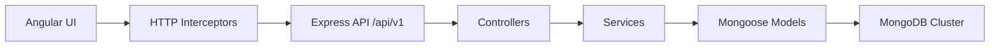

# Access Management Portal

Access Management Portal is an enterprise-style role-based access control and verification management system built with Angular, Node.js, TypeScript, Express, and MongoDB.

It includes secure login, role-based dashboards, user administration, verification record browsing, analytics, async loading states, and a polished SaaS-style UI inspired by products like Linear, Vercel, Clerk, and Notion.

## Overview

The application is split into two parts:

- `frontend/`: Angular 17 standalone SPA with Angular Material, SSR/prerender support, responsive dashboards, and global HTTP interceptors.
- `backend/`: Express + TypeScript API with JWT authentication, role authorization, MongoDB/Mongoose models, and modular service/controller architecture.

The backend exposes versioned REST endpoints under `/api/v1`, while the frontend consumes those APIs through environment-configured service clients.

## Features

### Authentication and Authorization

- JWT-based sign-in
- Persistent session handling
- Route protection for authenticated users
- Admin-only authorization for management pages and APIs

### User Dashboard

- Personal profile summary
- Verification records table
- Sorting, pagination, and search filtering
- Loading skeletons, empty states, and retry UI

### Admin Dashboard

- User management table
- Create, edit, and delete users
- Role and status filters
- Server-side pagination and search
- Admin summary stats and operational overview

### Async UX

- Global loading spinner
- Progress bar feedback
- Request retry handling
- Error retry UI
- Artificial API delay simulation for testing loading states

### Deployment Ready

- Vercel-friendly frontend configuration
- Production environment file replacement
- SPA route rewrites
- Environment-based API base URL handling

## Tech Stack

| Layer | Technologies |
|---|---|
| Frontend | Angular 17, TypeScript, RxJS, Angular Material, SCSS, NGX Charts |
| Backend | Node.js, Express, TypeScript, Mongoose, JWT, bcryptjs |
| Database | MongoDB Atlas / MongoDB Cluster |
| Tooling | ESLint, Prettier, tsx, Angular CLI |

## Architecture

### Frontend Architecture

```txt
src/app
├── core
│   ├── services
│   ├── guards
│   ├── interceptors
│   └── models
├── features
│   ├── auth
│   ├── dashboard
│   ├── users
│   ├── records
│   └── analytics
├── layouts
└── shared
```

### Backend Architecture

```txt
backend/src
├── config
├── controllers
├── middleware
├── models
├── routes
├── services
├── scripts
└── utils
```

### Request Flow



## Folder Structure

```txt
access-management-portal
├── backend
│   ├── src
│   └── package.json
├── frontend
│   ├── src
│   ├── angular.json
│   ├── vercel.json
│   └── package.json
└── README.md
```

## API Documentation

All API routes are served under `/api/v1`.

### Authentication

| Method | Endpoint | Description |
|---|---|---|
| POST | `/api/v1/auth/login` | Sign in with email and password |

Request body:

```json
{
  "email": "admin@amp.local",
  "password": "Admin@1234"
}
```

### Users

Admin-only endpoints.

| Method | Endpoint | Description |
|---|---|---|
| GET | `/api/v1/users` | List users with pagination, filtering, and search |
| POST | `/api/v1/users` | Create a new user |
| PUT | `/api/v1/users/:id` | Update a user |
| DELETE | `/api/v1/users/:id` | Delete a user |

Query parameters supported by `GET /users`:

- `page`
- `limit`
- `role`
- `status`
- `q`

### Records

| Method | Endpoint | Description |
|---|---|---|
| GET | `/api/v1/records` | List access records with pagination and filtering |
| GET | `/api/v1/records/:id` | Get a specific record |

Supported filters include:

- `page`
- `limit`
- `sortBy`
- `sortOrder`
- `status`
- `verificationType`
- `accessLevel`
- `userId`
- `approvedBy`
- `createdFrom`
- `createdTo`

### Analytics

| Method | Endpoint | Description |
|---|---|---|
| GET | `/api/v1/analytics/dashboard-stats` | Dashboard statistics for the analytics page |

### Health

| Method | Endpoint | Description |
|---|---|---|
| GET | `/api/v1/health` | Health and readiness check |

## Setup Instructions

### 1. Clone and install dependencies

```bash
git clone <your-repo-url>
cd access-management-portal
cd backend && npm install
cd ../frontend && npm install
```

### 2. Configure backend environment

Create a `backend/.env` file with the variables listed below.

### 3. Seed the database

```bash
cd backend
npm run seed
```

### 4. Run locally

Backend:

```bash
cd backend
npm run dev
```

Frontend:

```bash
cd frontend
npm start
```

## Deployment Instructions

### Frontend on Vercel

- Production builds use `frontend/src/environments/environment.production.ts`
- The frontend reads its API base URL from `environment.apiUrl`
- On Vercel, the API base URL is injected at build time via the `BACKEND_API_URL` environment variable

Steps:

1. Deploy the backend API (any host is fine).
2. In your Vercel project (Frontend), set `BACKEND_API_URL` to your backend API base URL, including `/api/v1`.
   - Example: `https://your-backend.example.com/api/v1`
3. Redeploy the frontend.

If `BACKEND_API_URL` is not set, the build falls back to `/api/v1` (which will hit the same host as the frontend).

Production build:

```bash
cd frontend
npm run build
```

### Backend Deployment

Deploy the Express API to your hosting platform of choice and set the required environment variables.

Recommended runtime settings:

- `NODE_ENV=production`
- `PORT=<your-host-provided-port>`
- `MONGODB_URI=<your MongoDB connection string>`

## Environment Variables

### Backend

| Variable | Required | Description |
|---|---|---|
| `MONGODB_URI` | Yes | MongoDB connection string |
| `JWT_SECRET` | Yes | Secret used to sign and verify JWTs |
| `JWT_EXPIRES_IN` | No | JWT expiration, defaults to `1h` |
| `PORT` | No | Server port, defaults to `3000` |
| `CORS_ORIGIN` | No | Allowed frontend origin(s), comma-separated |
| `NODE_ENV` | No | `development`, `test`, or `production` |
| `BCRYPT_SALT_ROUNDS` | No | Password hashing cost, defaults to `12` |

### Frontend

| Variable/File | Required | Description |
|---|---|---|
| `frontend/src/environments/environment.ts` | Yes | Development API base URL |
| `frontend/src/environments/environment.production.ts` | Yes | Production API base URL for builds |
| `BACKEND_API_URL` (Vercel env var) | No | Backend API base URL used for the Vercel build (defaults to `/api/v1`) |

## Screenshots

Add screenshots here to showcase the app in action:

- Login page
- User dashboard
- Admin dashboard
- Analytics dashboard

Suggested location:

```txt
docs/screenshots/
```

## Dummy Credentials

Run the seed script first to populate the database, then use these demo accounts:

| Role | Email | Password |
|---|---|---|
| Admin | `admin@amp.local` | `Admin@1234` |
| User | `ava.carter@amp.local` | `User@1234` |
| User | `noah.patel@amp.local` | `User@1234` |
| Disabled user | `mia.gomez@amp.local` | `User@1234` |

## MongoDB Collections

The seed script populates these collections:

- `users`
- `records`

## Scripts

### Backend

- `npm run dev`: Start the backend in development mode
- `npm run build`: Compile TypeScript
- `npm run start`: Run the compiled backend
- `npm run seed`: Seed MongoDB with demo users and records
- `npm run lint`: Run ESLint
- `npm run format`: Format backend source files

### Frontend

- `npm start`: Start Angular development server
- `npm run build`: Build the frontend for production
- `npm run test`: Run unit tests
- `npm run lint`: Run Angular linting
